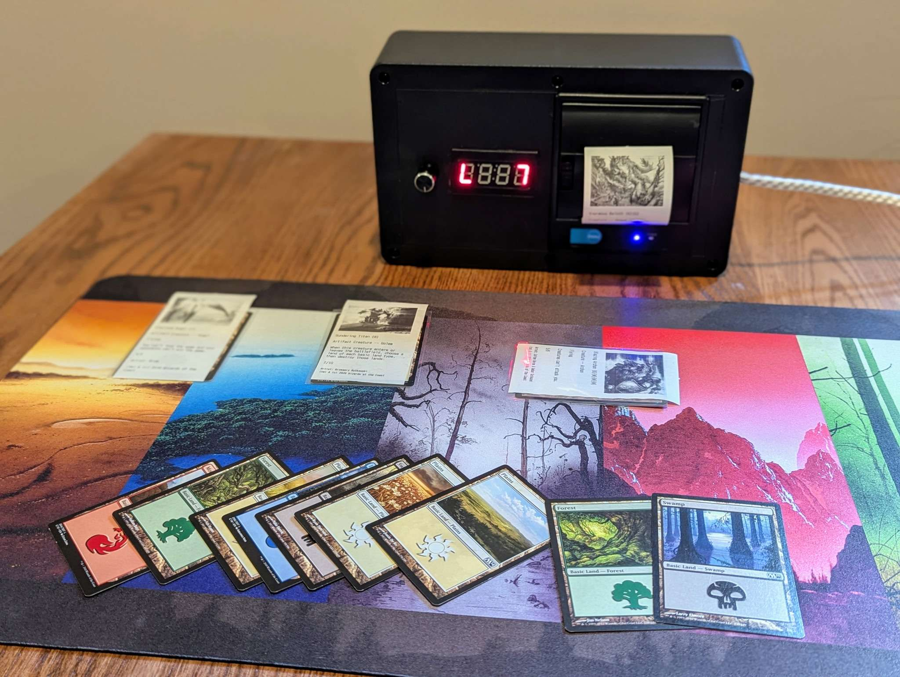

# Random Proxy Printer

This device prints a random proxy of a game piece that matches a predefined characteristic of the game piece.

The purpose of the device is to allow playing custom game formats in-person, when the game format would be impractical or impossible to do otherwise.



## Parts

The device consists of several parts.

 * A Raspberry Pi 4b running Raspbian
 * A 7 segement display
 * A rotary encoder
 * A thermal printer

TODO get exact part names

The 7 segement display is connected to the Raspberry Pi's I2C bus, the rotary encoder is connected to the GPIO pins, and the thermal printer is connected via USB. The game piece database and the executable are copied to the SD card and a systemd service is used to pass all required information to the code.

## Compiling

GOOS=linux GOARCH=arm64 GOARM=6 CGO_ENABLED=1 CC=aarch64-linux-gnu-gcc go build -o random-proxy-printer cmd/random-proxy-printer/main.go

## Systemd script

```
[Unit]
Description=Random Proxy Printer
After=local-fs.target
StartLimitIntervalSec=0

[Service]
Type=simple
Restart=always
RestartSec=1
User=jhendric
ExecStart=/home/justinh/random-proxy-printer -button 23 -chipName gpiochip0 -ht16k33Bus 1 -ht16k33HexAddress 70 -logging TRACE -printer /dev/usb/lp0 -proxies /home/justinh/proxies.sqlite3 -rotaryEncoderClock 24 -rotaryEncoderData 25

[Install]
WantedBy=default.target
```

## FAQ

* The proxies table is empty. How do I populate it?

I will not provide code to populate the proxies table in the database -- it would be a violation of the intellectual property of the company that owns the data.

* The fan policy for *[insert game here]* allows printing of proxies, can you include code to generate a proxies table for it?

No. This repository will not include any IP-related code. I am willing to link to any projects that create the proxies database, as long as it clearly does not violate any IP.

* Why publicly post the code if you aren't going to include the code to use it?

During the development of this project, I had to cross reference a lot of sparce documentation to get things working. It was frequently frustrating to figure out how to tie together all the pieces the way I wanted them. This Github project is as much a work log and amalgamation of the things I learned as it is a finished product.

* How can I add my own proxies to the database?

The code needs an SQLite3 database with the structure defined in `ddl.sql`. You can create your own SQLite3 database and update the systemd configuration to use it.

There are a few requirements of the data in the `description` and `illustration` fields.

The `description` must be in ASCII.

TODO document format of `illustration`
